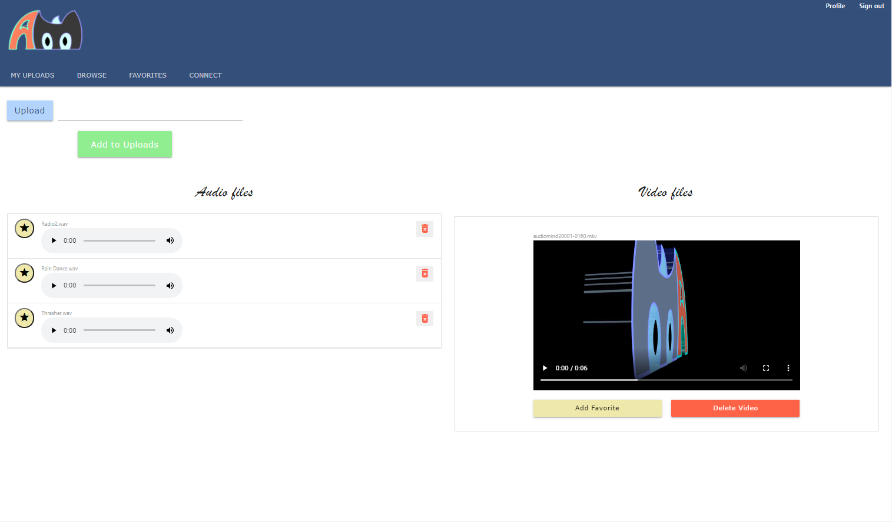

# AudioMind

AudioMind is a creative thinkspace which allows artists to upload custom tracks of music and create playlists. Users can collaborate with musicians around the world by uploading partial tracks or beats that other musicians can download and record over and reupload into the site. Future development will  include the ability to record directly within AudioMind. 

Users can create an account to form collaboration rooms with other musicians and develop the songs in private, and then release them publically once they are ready. The application works for a variety of audio and video file uploads that are saved to MongoDB via GridFS. 

Here is a link to the deployed version: http://audio-mind2.herokuapp.com/

The application has the following features:
- Upload audio and video files
- Authentication
- Save files to favorites page
- Delete files
- Play audio and video through the application
- Update user settings
- Mobile-friendly

Screenshot of the application:

AudioMind was created using ReactJS, Materialize, Node, Mongoose, an Express server, GridFS, Passport for authentication and was deployed with Heroku using mLab for data storage.

